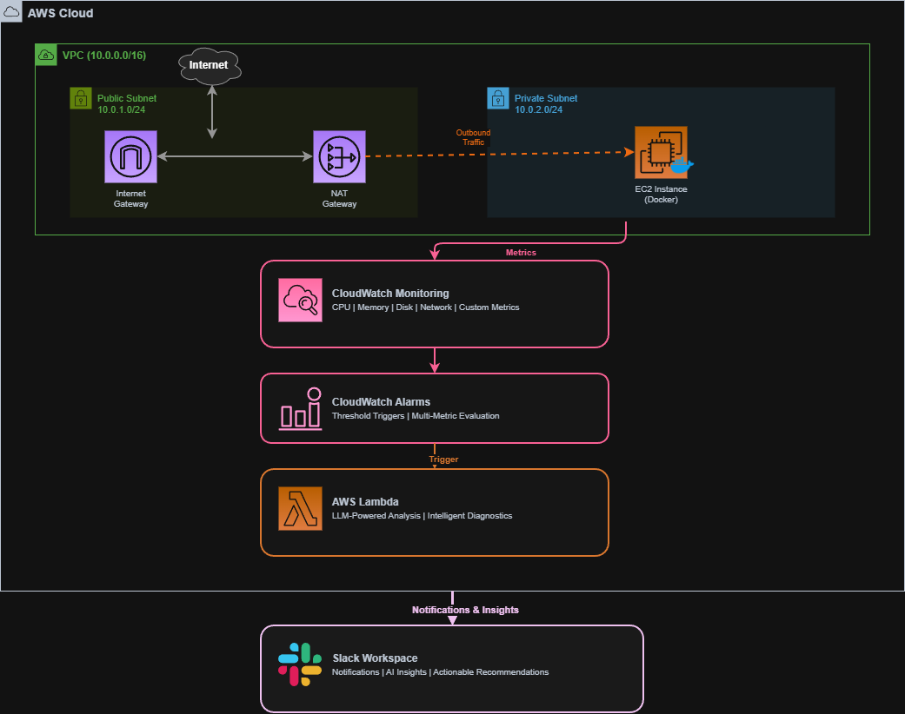

# Critical Scanning - Sistema de Monitoreo en AWS

## Descripción

Este proyecto implementa una infraestructura completa en AWS usando Terraform. La idea es tener un sistema de monitoreo que no solo alerte cuando algo falla, sino que también ayude a entender qué salió mal y cómo solucionarlo.

El sistema monitorea instancias EC2 con CloudWatch, y cuando detecta un problema, usa Lambda con un LLM para analizar la situación y enviar notificaciones a Slack con diagnósticos y sugerencias de solución.

## Arquitectura del Sistema

### Componentes Principales



### Cómo funciona

1. CloudWatch recopila métricas de las instancias EC2 (CPU, memoria, red, disco)
2. Las alarmas evalúan estas métricas contra umbrales configurados
3. Cuando algo excede el umbral, se dispara una alarma
4. La alarma activa una función Lambda
5. Lambda usa un LLM para analizar el problema y generar un diagnóstico
6. Se envía una notificación a Slack con el análisis y recomendaciones prácticas

## Módulos de Infraestructura

### 1. Módulo de Networking

Configura la red en AWS:

- VPC dedicada (10.0.0.0/16)
- Subnet pública (10.0.1.0/24): contiene el NAT Gateway e Internet Gateway
- Subnet privada (10.0.2.0/24): donde vive la instancia EC2, sin acceso directo desde internet

La configuración es estándar para servicios que necesitan estar aislados de internet pero poder hacer conexiones salientes.

**Archivos**:
- `modules/NETWORKING/vpc.tf`
- `modules/NETWORKING/public_subnets.tf`
- `modules/NETWORKING/private_subnets.tf`

### 2. Módulo de EC2

Maneja la instancia donde corren las aplicaciones:

- Instancia t2.micro con CPU credits ilimitados
- Ubuntu (ami-0f5fcdfbd140e4ab7)
- IP privada fija (10.0.2.10)
- Docker se instala automáticamente al iniciar la instancia mediante user_data

El script `docker_base_installation.sh` hace:
- Crea un usuario `dockeruser` con su grupo
- Instala Docker Engine y Docker Compose
- Configura todo para que inicie automáticamente

**Archivos**:
- `modules/EC2/ec2.tf`
- `modules/EC2/docker_base_installation.sh`

### 3. Módulo de IAM

Configura permisos y accesos:

1. **Usuario de Testing** (`testing-user-terraform`):
   - Requiere MFA obligatoriamente, sin MFA no puede hacer nada
   - Tiene acceso completo a EC2 cuando está autenticado

2. **Rol para EC2** (`ec2-ssm-role`):
   - Permite conectarse a la instancia vía Systems Manager (sin SSH)
   - Permite enviar métricas y logs a CloudWatch

3. **Instance Profile** (`ec2-ssm-profile`):
   - Asocia el rol a la instancia EC2

De esta forma la instancia no necesita credenciales hardcodeadas, todo se maneja con el rol.

**Archivos**:
- `modules/IAM/Iam.tf`

## Sistema de Monitoreo y Alertas

### CloudWatch

CloudWatch monitorea las siguientes métricas:
- CPU
- Memoria
- Disco (I/O)
- Red
- Métricas custom de contenedores Docker

Las alarmas se disparan cuando:
- CPU >80% por más de 5 minutos
- Memoria >90%
- Red con latencia elevada
- Errores en aplicaciones

### Lambda con LLM

Cuando se dispara una alarma, Lambda hace lo siguiente:

1. Recibe el evento de CloudWatch con los detalles
2. Obtiene datos históricos de las últimas 24 horas
3. Envía todo al LLM (Python) para que analice qué pudo haber pasado
4. El LLM genera hipótesis sobre la causa y sugerencias de solución
5. Se formatea todo y se envía a Slack

### Notificaciones en Slack

**Formato de Alertas**:
Las notificaciones incluyen:

```
ALERTA: Alto Uso de CPU en ec2_dev_instance

Métricas:
• CPU: 87.3%
• Duración: 6 minutos
• Umbral: 80%

Análisis AI:
"El pico de CPU puede estar relacionado con un proceso en contenedor
Docker. Basado en el patrón temporal, es probable que sea un job
programado que inició a las 14:00 UTC."

Recomendaciones:
1. Revisar contenedores activos: docker ps --format "{{.Names}}: {{.CPUPerc}}"
2. Verificar jobs de cron en los contenedores
3. Considerar escalar verticalmente si es recurrente

Acciones:
• Ver métricas en CloudWatch
• Conectar vía SSM Session Manager
```

## Prerequisitos

### Software Requerido

- **Terraform** >= 1.5.0
- **AWS CLI** >= 2.0
- **Cuenta de AWS** con permisos administrativos

### Configuración AWS

1. Configurar credenciales:
```bash
aws configure
```

2. Verificar acceso:
```bash
aws sts get-caller-identity
```

## Cómo Desplegar

### 1. Clonar el repo

```bash
git clone <repository-url>
cd Critical_Scanning
```

### 2. Configurar región (opcional)

Editar `Terraform/variable_values.auto.tfvars` si quieres cambiar la región:

```hcl
region = "us-east-2"
```

### 3. Inicializar Terraform

```bash
cd Terraform
terraform init
```

### 4. Revisar qué se va a crear

```bash
terraform plan
```

Esto creará: VPC, 2 subnets, Internet Gateway, NAT Gateway, 1 EC2, y roles IAM.

### 5. Desplegar

```bash
terraform apply
```

Confirma con `yes`. Tarda unos 3-5 minutos.

### 6. Verificar

```bash
# Ver la instancia
aws ec2 describe-instances \
  --filters "Name=tag:Name,Values=ec2_dev_instance" \
  --query 'Reservations[0].Instances[0].[InstanceId,State.Name,PrivateIpAddress]'

# Conectar por SSM
aws ssm start-session --target <instance-id>

# Verificar Docker
docker --version
docker ps
```

### 7. Post-despliegue

El monitoreo con CloudWatch, Lambda y Slack se integra manualmente después del despliegue inicial de los servicios ya vistos.

## Estructura del Proyecto

```
Critical_Scanning/
├── README.md                          # Documentación principal
├── Terraform/
│   ├── main.tf                        # Orquestación de módulos
│   ├── providers.tf                   # Configuración de AWS provider
│   ├── variables.tf                   # Variables globales
│   ├── variable_values.auto.tfvars    # Valores de variables
│   │
│   └── modules/
│       ├── NETWORKING/
│       │   ├── vpc.tf                 # VPC principal
│       │   ├── public_subnets.tf      # Subnet pública + IGW
│       │   ├── private_subnets.tf     # Subnet privada + NAT
│       │   └── outputs.tf             # Outputs del módulo
│       │
│       ├── EC2/
│       │   ├── ec2.tf                 # Instancia y ENI
│       │   ├── variables.tf           # Variables del módulo
│       │   └── docker_base_installation.sh  # Bootstrapping
│       │
│       └── IAM/
│           ├── Iam.tf                 # Roles, políticas y users
│           └── outputs.tf             # Instance profile
```

## Gestión del Proyecto

### Conectividad a la Instancia

Se usa AWS Systems Manager para conectarse a la instancia sin necesidad de SSH ni IPs públicas:

```bash
# Listar instancias disponibles
aws ssm describe-instance-information

# Iniciar sesión interactiva
aws ssm start-session --target i-xxxxxxxxxxxxx

# Ejecutar comando remoto
aws ssm send-command \
  --instance-ids i-xxxxxxxxxxxxx \
  --document-name "AWS-RunShellScript" \
  --parameters 'commands=["docker ps"]'
```

## Seguridad

### Red

- Las instancias están en una subnet privada, no tienen IP pública
- Solo pueden acceder a internet a través del NAT Gateway
- VPC dedicada separada de otros recursos

### IAM

- MFA obligatorio para el usuario de testing
- La instancia EC2 usa roles, no credenciales hardcodeadas
- Permisos mínimos necesarios: solo SSM y CloudWatch

### Acceso

- Conexiones vía Systems Manager, sin SSH
- Las credenciales se rotan automáticamente
- Todo queda registrado en CloudWatch Logs y CloudTrail

## Para Producción

### Escalabilidad

Si necesitas más capacidad:
- Auto Scaling Groups para escalar horizontalmente
- Load Balancer para distribuir tráfico
- RDS en vez de bases de datos en EC2
- S3 para almacenar logs y backups

### Alta Disponibilidad

- Distribuir en múltiples AZs
- Auto Scaling con health checks
- Multi-AZ para RDS

### Costos Actuales

- EC2 t2.micro: ~$8.50/mes
- NAT Gateway: ~$32/mes
- CloudWatch: free tier
- Total: ~$40-50/mes

Para reducir costos:
- Reserved Instances (ahorro de hasta 72%)
- Spot Instances para cargas no críticas
- VPC Endpoints en vez de NAT Gateway

## Monitoreo

### Qué se puede monitorear

Infraestructura:
- Salud de las instancias
- Uso del NAT Gateway
- Tráfico de red

Aplicación:
- Estado de contenedores Docker
- Recursos usados por contenedor
- Logs

Costos:
- Cost Explorer
- Budgets con alertas

### Dashboards en CloudWatch

Se pueden crear dashboards para:
- Vista general de infraestructura (VPC, EC2, alarmas)
- Performance de aplicaciones (Docker, logs, errores)
- Seguridad (accesos, eventos IAM, cambios)

## Problemas Comunes Enfrentados

**La instancia no aparece en SSM**
```bash
# Verificar que tiene el rol correcto
aws ec2 describe-instances --instance-ids i-xxxxx \
  --query 'Reservations[0].Instances[0].IamInstanceProfile'

# Ver logs del agent
sudo journalctl -u amazon-ssm-agent

**Sin internet en la subnet privada**
```bash
# Verificar NAT Gateway
aws ec2 describe-nat-gateways --filter "Name=vpc-id,Values=vpc-xxxxx"

# Ver route tables
aws ec2 describe-route-tables --filters "Name=vpc-id,Values=vpc-xxxxx"
```

**Las alarmas no se disparan**
```bash
# Estado de la alarma
aws cloudwatch describe-alarms --alarm-names <alarm-name>

# Ver métricas
aws cloudwatch get-metric-statistics \
  --namespace AWS/EC2 \
  --metric-name CPUUtilization \
  --dimensions Name=InstanceId,Value=i-xxxxx \
  --start-time 2024-01-01T00:00:00Z \
  --end-time 2024-01-01T23:59:59Z \
  --period 300 \
  --statistics Average
```

## Roadmap Futuro

### Mejoras Planificadas

- [ ] Implementación de CI/CD con GitHub Actions
- [ ] Terraform Cloud para state management remoto
- [ ] Integración con Prometheus/Grafana
- [ ] Implementación de WAF para protección web
- [ ] Secrets management con AWS Secrets Manager
- [ ] Backup automático con AWS Backup
- [ ] Disaster recovery plan automatizado
- [ ] Compliance monitoring (CIS, PCI-DSS)

## Licencia

MIT

## Contacto

- Issues en GitHub
- Email: [tu-email@ejemplo.com]

---

**Última actualización**: Enero 2026
**Versión**: 1.0.0
**Mantenido por**: [Tu Nombre/Organización]
